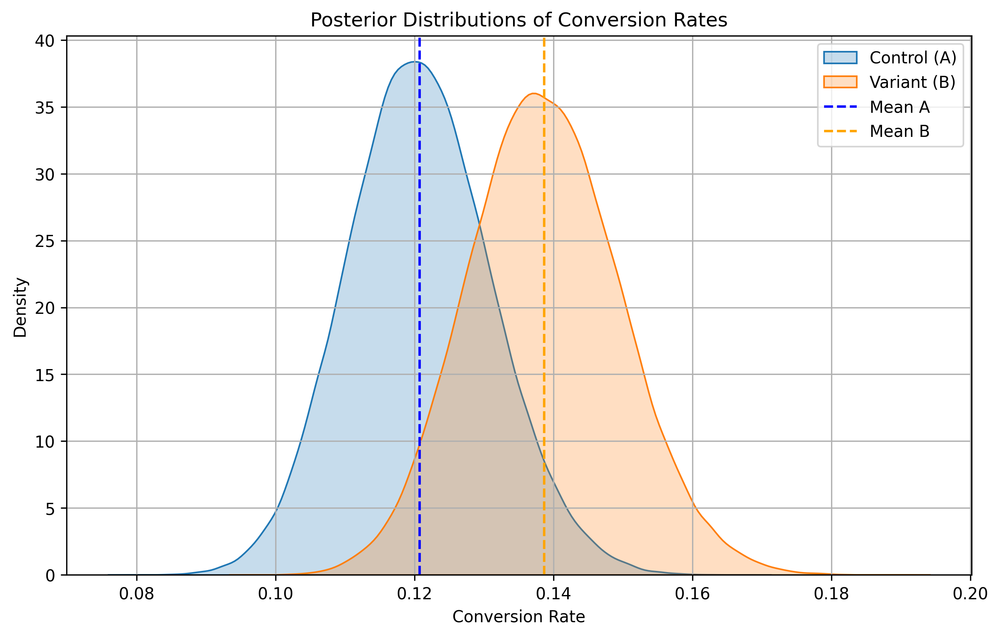

# 🧪 A/B Testing – Conversion Rate Experiment

This project demonstrates a complete A/B test analysis using simulated binary outcome data. It is part of a strategic data science portfolio tailored for roles in e-commerce optimization and experimentation leadership.

## 🎯 Objective

Evaluate whether a new website or product variant leads to a statistically significant improvement in customer conversion rates compared to a control version.

## 📦 What's Included

- Simulated user-level binary conversion data (`converted = 1` or `0`)
- Proportional z-test to compare conversion rates between control and variant groups
- Bayesian A/B testing using Beta-Binomial modeling for robust inference
- Visual comparison of conversion outcomes and posterior distributions
- Clear business interpretation of results

## ✅ Methodology

### Classical Approach

- Classical **two-proportion z-test** using `scipy.stats`  
- Confidence intervals and p-values interpreted for business impact  
- Statistical assumptions clearly stated and respected  

### Bayesian Approach

- Bayesian inference modeling conversion rates as Beta distributions  
- Posterior sampling to estimate probability that variant outperforms control  
- Credible intervals and probabilistic conclusions supporting decision-making  
- More intuitive uncertainty quantification, especially useful for smaller samples or sequential testing  

## 📊 Tools Used

- Python 3.x  
- `pandas` for data wrangling  
- `numpy` for calculations  
- `scipy.stats` for classical statistical testing  
- `matplotlib` and `seaborn` for visualizations  
- `scipy.stats` Beta distributions and Monte Carlo sampling for Bayesian inference  

## 🧪 Z-Test Summary

A z-test checks whether the observed difference between conversion rates is likely due to random chance. The key elements are:

| Element        | Description |
|----------------|-------------|
| **Null Hypothesis (H₀)** | No difference in conversion rates |
| **Alternative Hypothesis (H₁)** | Variant conversion rate ≠ control conversion rate |
| **p-value** | Probability of observing the difference (or more extreme) if H₀ were true |
| **α (Significance Threshold)** | 0.05 commonly used in business settings |
| **Decision Rule** | Reject H₀ if p-value < 0.05 |

## 📈 Visualization

The analysis includes:

- Barplot with 95% confidence intervals showing average conversion rate by group (control vs. variant)  
- Posterior distribution plots showing uncertainty and probabilistic dominance of variant over control  

These visuals help both technical and non-technical stakeholders quickly interpret the impact.

## 📌 Assumptions

- Binary outcomes are independent and identically distributed  
- Sample size is large enough for the normal approximation to hold (classical test)  
- No major external changes (e.g., ad campaigns, holidays) confound the results  
- Bayesian approach relaxes some assumptions, providing more flexibility and interpretability  

## 💡 Business Interpretation

- If the p-value is **< 0.05**, classical testing considers the result **statistically significant** and recommends launching the variant broadly.  
- Bayesian inference provides a probability of the variant outperforming control, allowing nuanced decisions beyond binary significance.  
- If results are **not significant** or the probability of improvement is low, consider maintaining the control experience or redesigning experiments.  

---

This repo can be extended with:

- Power analysis and sample size planning  
- Real aggregated conversion metrics (e.g., from web traffic logs or event data)  
- Additional Bayesian modeling techniques and hierarchical extensions
